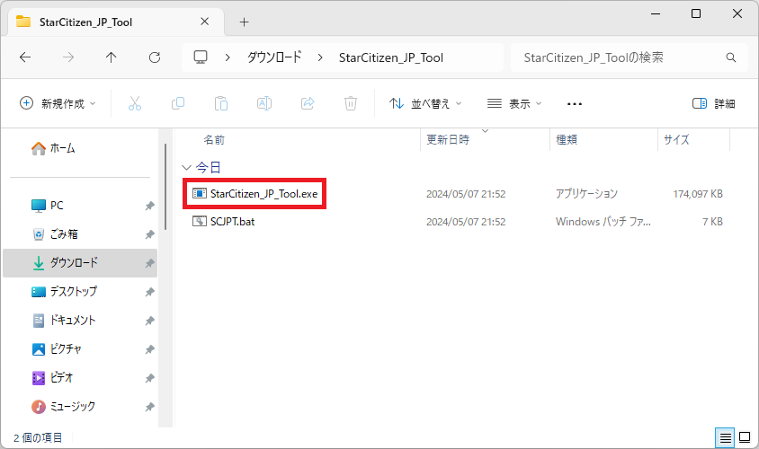
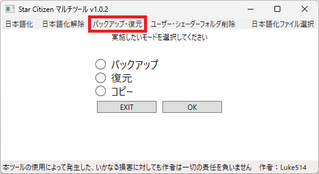
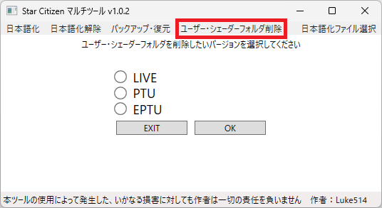
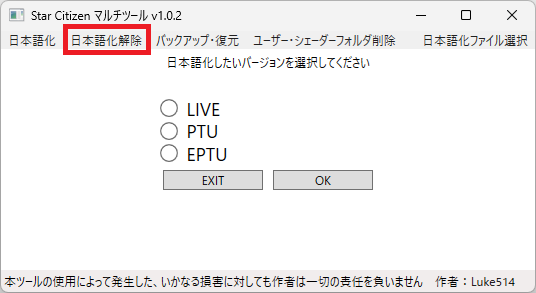
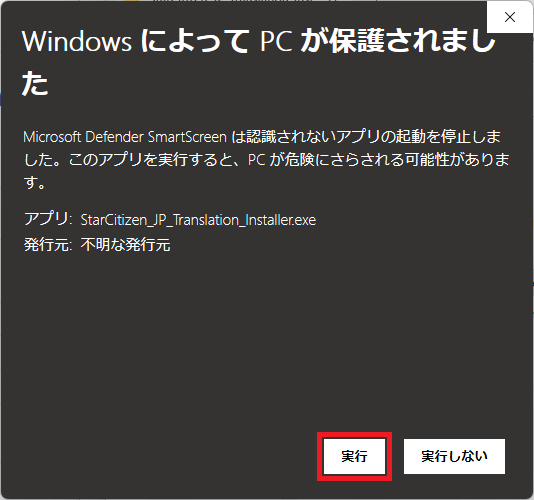
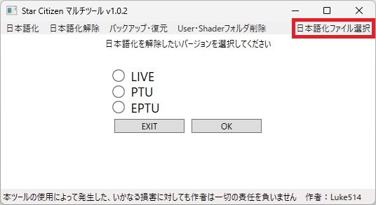

# これは何をするためのもの？
スターシチズンを日本語化するための設定を自動で行ったり、  
設定のバックアップ、ユーザーフォルダの削除などを行うツールです。  
  
# 主な機能
・スターシチズンの日本語化・日本語化解除  
&emsp;(最新の[日本語化ファイル](https://github.com/stdblue/StarCitizenJapaneseResources)を自動で取得します)  
・設定のバックアップ・復元・コピー  
・ユーザー・シェーダーフォルダの削除  
  
# バックアップ・復元ツールの利用上の注意
操作プロファイル・キャラクタープロファイルは手動でゲーム内からImport/Exportする必要があります  
(操作プロファイル・キャラクタープロファイル以外はImport/Exportしなくても適用されます)  
  
操作プロファイルの詳しいImport/Export方法は以下を参考にしてください  
https://support.robertsspaceindustries.com/hc/en-us/articles/360000183328-Create-export-and-import-custom-profiles  
  
コピー機能はバックアップされた設定等を別のバージョンのバックアップフォルダへコピーする機能です  
  
# ユーザー・シェーダーフォルダ削除ツールの利用上の注意
本ツールはStar Citizenのアップデート前に使うことをお勧めします  
  
PTUがLIVEのマイナーパッチをテストしている場合は、LIVEのシェーダーフォルダも削除されます  
マイナーパッチの例) LIVE: 3.17.4 PTU: 3.17.5  
メジャーパッチの例) LIVE: 3.17.5 PTU: 3.18.0  
  
削除対象に表示されたフォルダは中身ごと完全削除しますので、  
表示された対象をよく確認してから削除を実施してください  
  
操作設定等は消去されますので、必要な方はバックアップ・復元ツールでバックアップしてください  
  
# ツールの入手と起動
1.&nbsp;[Releases](https://github.com/Luke-514/StarCitizen_JP_Tool/releases/latest)からツールのZIPファイル(StarCitizen_JP_Tool.zip)をダウンロードします  
  
2.&nbsp;任意の場所でZIPファイルを展開し、StarCitizen_JP_Tool.exeを起動してください  
&emsp;(展開したフォルダ内にあるファイルはツールの動作に必要ですので、削除しないよう気を付けてください)  
  
  
# 日本語化ツールの使い方
1.&nbsp;日本語化ボタンを押します  
&emsp;(ツール起動時は日本語化ツールが選択されています)  
  
2.&nbsp;日本語化したいバージョンを選択し、OKボタンを押してください  
&emsp;(通常はLIVEでOKです)  
  
3.&nbsp;確認画面が出ますので、問題なければYESボタンを押してください  
&emsp;(NOを押すと、前の画面に戻ります)  
  
4.&nbsp;「日本語化が完了しました。」と出力されていれば、日本語化が完了しているはずですので、  
&emsp;ゲームを起動してみてください  
  
# バックアップ・復元ツールの使い方
1.&nbsp;バックアップ・復元ボタンを押します  
  
  
2.&nbsp;バックアップ・復元・コピーのうち、実施したいモードを選択してOKボタンを押してください  
  
3.&nbsp;LIVE、PTU、EPTUのうち、実施したいバージョンを選択します  
&emsp;(コピーを実施する場合はコピー元とコピー先のバージョンを選択してください)  
  
4.&nbsp;対象のファイル等が表示されるので、問題なければYESボタンを押してください  
  
# ユーザー・シェーダーフォルダ削除ツールの使い方
1.&nbsp;ユーザー・シェーダーフォルダ削除ボタンを押します  
  
  
2.&nbsp;ユーザー・シェーダーフォルダを消したいバージョンを選択してOKボタンを押してください  
  
3.&nbsp;削除対象が表示されるので、問題なければYESボタンを押してください  
  
# よくある質問
Q.&nbsp;自分で配置したuser.cfgがある場合はどうなりますか？  
A.&nbsp;user.cfgが配置されている場合は日本語化に必要な情報を追記します。  
&emsp;(既に必要な情報が記載されていれば何もしません)  
  
Q.&nbsp;global.ini(翻訳ファイル)を更新したい。  
A.&nbsp;通常通りに日本語化の手順を実行すると、最新版のglobal.iniを取得し、更新します。  
  
Q.&nbsp;日本語化を解除したい  
A.&nbsp;左上の日本語化解除ボタンを押して、日本語化解除モードへ切り替えてください。  
&emsp;(その後の操作方法は日本語化の時とほぼ同じです)  
  
  
Q.&nbsp;ツールを起動するとWindows Defenderに止められる  
A.&nbsp;詳細情報を押すと出てくる実行ボタンを押してください  

  
  
Q.&nbsp;任意のglobal.iniを導入したい(テストバージョンなど)  
A.&nbsp;日本語化ファイル選択ボタンを押して、日本語化ファイルを選択した後に日本語化を実施してください  
&emsp;(ツールのあるフォルダに日本語化ファイルを配置して日本語化を実施してもよいです)  
  
  
# 免責事項
本ツールの使用によって発生した、いかなる損害に対しても作者は一切の責任を負いません。  
Star Citizen®、Roberts Space Industries®、Cloud Imperium®はCloud Imperium Rights LLCの登録商標です。  
  
# 作者
Luke514  
Twitter:@rx_luke  
Star Citizen紹介コード(referral code) → 【STAR-9YPT-ZV5J】 
  
# Special Thanks
NTKestrel  
Shinnryuu  
