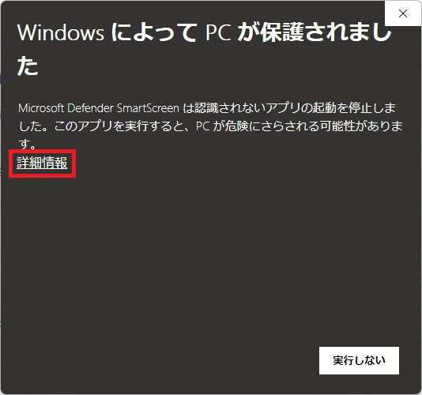

# これは何をするためのもの？
スターシチズンを日本語化するための[日本語化ファイル](https://github.com/stdblue/StarCitizenJapaneseResources)の配置場所や、設定方法が分からないという方でも  
簡単に日本語化できるようにする日本語化支援ツールです。  
  
# 使い方
1.&nbsp;[Releases](https://github.com/Luke-514/StarCitizen-Translation-Installer-GUI/releases/latest)から支援ツールのZIPファイル(StarCitizen_JP_Translation_Installer_GUI.zip)をダウンロードします。  
  
2.&nbsp;任意の場所でZIPファイルを展開し、StarCitizen_JP_Translation_Installer.exeを起動してください。  
&emsp;(展開したフォルダ内にあるファイルはツールの動作に必要ですので、削除しないよう気を付けてください)  
  
  
3.&nbsp;日本語化したいバージョンを選択し、OKボタンを押してください。  
&emsp;(通常はLIVEでOKです)  
  
  
4.&nbsp;確認画面が出ますので、問題なければYESボタンを押してください。  
&emsp;(NOを押すと、前の画面に戻ります)  
  
  
5.&nbsp;「日本語化が完了しました。」と出力されていれば、日本語化が完了しているはずですので、  
&emsp;ゲームを起動してみてください。  
  
  
# よくある質問
Q.&nbsp;自分で配置したuser.cfgがある場合はどうなりますか？  
A.&nbsp;user.cfgが配置されている場合は日本語化に必要な情報を追記します。  
&emsp;(既に必要な情報が記載されていれば何もしません)  
  
Q.&nbsp;global.ini(翻訳ファイル)を更新したい。  
A.&nbsp;通常通りに日本語化の手順を実行すると、最新版のglobal.iniを取得し、更新します。  
  
Q.&nbsp;日本語化を解除したい  
A.&nbsp;左上の日本語化解除ボタンを押して、モードを切り替えてください。  
&emsp;(その後の操作方法は日本語化の時とほぼ同じです)  
  
  
Q.&nbsp;ツールを起動するとWindows Defenderに止められる  
A.&nbsp;詳細情報を押すと出てくる実行ボタンを押してください  

  
  
Q.&nbsp;任意のglobal.iniを導入したい(テストバージョンなど)  
A.&nbsp;ツールのあるフォルダに任意のglobal.iniを配置してツールを実行してください  
  
  
# 免責事項
本ツールの使用によって発生した、いかなる損害に対しても作者は一切の責任を負いません。  
Star Citizen®、Roberts Space Industries®、Cloud Imperium®はCloud Imperium Rights LLCの登録商標です。  
  
# 作者
Luke514  
Twitter:@rx_luke  
Star Citizen紹介コード(referral code) → 【STAR-9YPT-ZV5J】 
  
# Special Thanks
MoMoShrine  
クレクレ柴犬  
NTKestrel  
Popolilo  
Star Citizen Japan Community
