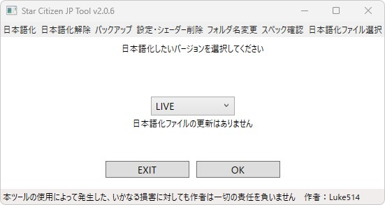
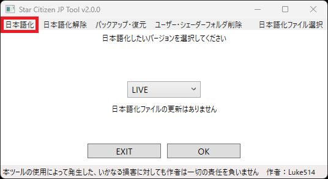
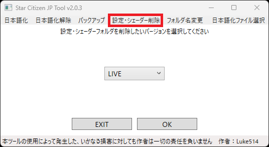
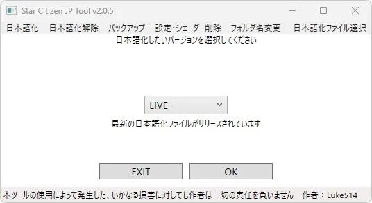
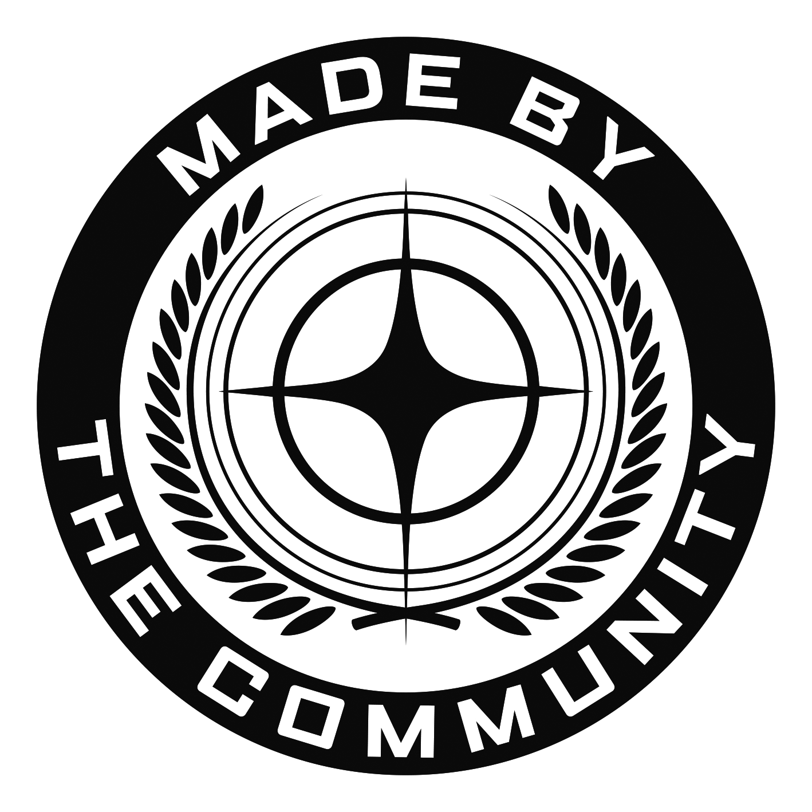

# これは何をするためのもの？
Star Citizenを日本語化するための設定を自動で行うツールです。  
[支援版(有料)](https://luke514.booth.pm/items/7695181)では設定のバックアップ、ユーザーフォルダの削除などを行うこともできます。  
  
  
  
# 主な機能
・Star Citizenの日本語化、日本語化解除  
&emsp;(最新の[日本語化ファイル](https://github.com/stdblue/StarCitizenJapaneseResources)を自動で取得します)  
・日本語化ファイル、ツールの更新確認  
・作者独自の推奨スペック確認  

# 支援版限定の機能
・設定のバックアップ、復元、コピー  
・ユーザー、シェーダーフォルダの削除  
・ゲームフォルダ名の変更  
・更新確認機能のON/OFF  
・ツールの最前面表示ON/OFF  
・ウィンドウサイズの自動調整ON/OFF  
・テキストサイズ変更  
・日本語化ファイル取得先変更  
  
# ツールの入手と起動
1.&nbsp;[Releases](https://github.com/Luke-514/StarCitizen_JP_Tool/releases/latest)からツールのZIPファイル(StarCitizen_JP_Tool.zip)をダウンロードします  
  
2.&nbsp;任意の場所でZIPファイルを展開し、StarCitizen_JP_Tool.exeを起動してください  
&emsp;  
  
# 利用上の注意(共通)
> [!CAUTION]  
>・一度もStar Citizenを起動したことが無い場合は、ツールの利用前にStar Citizenを起動してください  
>&emsp;(Star Citizenを起動しないとインストール先の情報がログに書き込まれないため)  
>  
> &emsp;Star Citizenのアカウント登録、購入、インストールの方法は以下の記事をご覧ください  
> &emsp;https://lukesplaygrounds.com/how-to-start-star-citizen/  
>  
>・ツールを利用される際はStar Citizenを落としてからご利用ください  
>&emsp;(Star Citizenを起動したままだと設定などが反映されません)  
>  
>・自動で生成されるToolDataフォルダは削除しないでください  
>&emsp;(削除するとツールが正しく動作しなくなる可能性があります)  
>  
>・日本語化ファイルは翻訳途中のため、英語/機械翻訳/手動翻訳が混ざっています  
>&emsp;ローカライゼーション自体にバグが点在しています  
  
# バックアップツール利用上の注意(支援版限定)
> [!CAUTION]  
>・バージョンによってはキーバインドや各種設定の内容が大幅に変わり、  
>&emsp;復元しても正しく動作しない可能性があります  
>  
>・キャラクターファイルをバックアップ・復元する場合は、  
>&emsp;手動でキャラクターカスタマイズ画面からImport/Exportする必要があります  
>&emsp;  
>&emsp;  
>  
>・操作プロファイルをバックアップ・復元する場合は、手動でゲーム内からImport/Exportする必要があります  
>&emsp;詳しい手順は[公式ナレッジ](https://support.robertsspaceindustries.com/hc/en-us/articles/360000183328-Create-export-and-import-custom-profiles)を参考にしてください  
>  
>・グラフィックレンダラーの設定はバックアップできません  
>  
>・コピー機能はバックアップされた設定などを別のバージョンのバックアップフォルダへコピーする機能です  
> &emsp;(コピー後はコピー先のバージョンで復元を実施しないと設定が反映されません)  
>  
>・バックアップしたファイルなどは、ツールのあるフォルダに生成されるBackupDataフォルダ内にあります  
  
# 設定・シェーダー削除ツール利用上の注意(支援版限定)
> [!CAUTION]
> ・バージョン関係なく全てのシェーダーフォルダを削除します  
> &emsp;(ユーザーフォルダは選択したバージョンのものを削除します)
>  
> ・削除対象に表示されたフォルダは中身ごと完全削除しますので、  
> &emsp;表示された対象をよく確認してから削除を実施してください  
>  
> ・操作設定等は消去されますので、必要な方はバックアップツールでバックアップしてください  
  
> [!NOTE]  
> ユーザー・シェーダーフォルダは公式ランチャーから削除できるようになったため、  
> 基本的にはそちらを利用されることをおすすめします
  
# ゲームフォルダ名変更ツール利用上の注意(支援版限定)
> [!CAUTION]  
>・複数のバージョンがインストールされていると正しく動作しません  
>&emsp;インストールされているバージョンが１つのときのみお使いください
  
# 推奨スペックチェックツール利用上の注意
> [!CAUTION]  
>・あくまでも作者が考えた推奨スペックに適合するかのチェックツールです  
>&emsp;一部がNGでも、遊ぶことのできるPCは沢山ありますので、参考程度にご利用ください  
>
> ・一部特殊な製品は登録していないため、結果がNGとして表示されることがあります
>
> ・Star Citizenがインストールされていなくても使用可能な[スタンドアロン版](https://github.com/Luke-514/StarCitizen_Spec_Check_Tool)もあります
> 
> ・判定基準などは以下の記事をご覧ください  
>&emsp;https://lukesplaygrounds.com/recommended-pc-specs-for-star-citizen/  
  
# 日本語化ツールの使い方
1.&nbsp;日本語化ボタンを押します  
&nbsp;&emsp;(ツール起動時は日本語化ツールが選択されています)  
&nbsp;&emsp;  
  
2.&nbsp;日本語化したいバージョンを選択し、OKボタンを押してください  
&nbsp;&emsp;(通常はLIVEでOKです)  
  
3.&nbsp;確認画面が出ますので、問題なければYESボタンを押してください  
&nbsp;&emsp;(NOを押すと、前の画面に戻ります)  
  
4.&nbsp;「日本語化が完了しました。」と出力されていれば、日本語化が完了しているはずですので、  
&nbsp;&emsp;ゲームを起動してみてください  
  
# バックアップツールの使い方(支援版限定)
1.&nbsp;バックアップボタンを押します  
&emsp;  
  
2.&nbsp;バックアップ・復元・コピーのうち、実施したいモードを選択してOKボタンを押してください  
  
3.&nbsp;LIVE、PTU、EPTUのうち、実施したいバージョンを選択します  
&nbsp;&emsp;(コピーを実施する場合はコピー元とコピー先のバージョンを選択してください)  
  
4.&nbsp;対象のファイル等が表示されるので、問題なければYESボタンを押してください  
  
※設定を別のバージョンにコピーしたい場合はバックアップ → コピー → 復元の順番で実施してください  
&emsp;例：LIVEをバックアップ → LIVEからPTUにコピー → PTUを復元  
  
# 設定・シェーダー削除ツールの使い方(支援版限定)
1.&nbsp;設定・シェーダーフォルダ削除ボタンを押します  
&nbsp;&emsp;  
  
2.&nbsp;設定・シェーダーフォルダを消したいバージョンを選択してOKボタンを押してください  
  
3.&nbsp;削除対象が表示されるので、問題なければYESボタンを押してください  
  
# ゲームフォルダ名変更ツールの使い方(支援版限定)
1.&nbsp;フォルダ名変更ボタンを押します  
&nbsp;&emsp;  
  
2.&nbsp;変更前と変更後のバージョンを選択して、OKボタンを押してください  
  
3.&nbsp;確認画面が出ますので、問題なければYESボタンを押してください  
  
# 推奨スペックチェックツールの使い方
1.&nbsp;スペック確認ボタンを押します  
&nbsp;&emsp;  
  
2.&nbsp;推奨スペック確認を実行してもよければ、OKボタンを押してください  
  
# よくある質問
Q.&nbsp;自分で配置したuser.cfgがある場合はどうなりますか？  
A.&nbsp;user.cfgが配置されている場合は日本語化に必要な情報を追記します。  
&nbsp;&emsp;(既に必要な情報が記載されていれば何もしません)  
  
Q.&nbsp;アップデート後にStar Citizenを起動したら、文字化けのような表示が出た  
A.&nbsp;ツールを起動し、「最新の日本語化ファイルがリリースされています」と出ている場合は、  
&nbsp;&emsp;日本語化ファイルが更新されていますので、再度日本語化を実施してください  
&nbsp;&emsp;  
  
Q.&nbsp;日本語化を解除したい  
A.&nbsp;左上の日本語化解除ボタンを押して、日本語化解除モードへ切り替えてください。  
&nbsp;&emsp;(その後の操作方法は日本語化の時とほぼ同じです)  
&nbsp;&emsp;  
  
Q.&nbsp;ツールを起動するとWindows Defenderに止められる  
A.&nbsp;詳細情報を押すと出てくる実行ボタンを押してください  
&emsp;
  
  
Q.&nbsp;任意の日本語化ファイルを導入したい(検証用バージョン等)  
A.&nbsp;日本語化ファイル選択ボタンを押して、global.iniを選択した後に日本語化を実施してください  
&nbsp;&emsp;(ツールのあるフォルダにglobal.iniを配置して日本語化を実施してもよいです)  
&nbsp;&emsp;  
  
Q.&nbsp;LIVE以外の日本語化ファイルが最新かどうか確認したい  
A.&nbsp;日本語化モードの状態で確認したいバージョンを選択すると、最新の日本語化ファイルかどうかが表示されます  
  
Q.&nbsp;Star Citizenがクラッシュした後に、ツールを利用しようとしたら起動しなくなった  
A.&nbsp;Star Citizenをもう一度起動しなおし、正常に終了させてから、ツールを起動してみてください  
  
Q.&nbsp;ツールをしばらく使っていたら、ツールの動作がおかしくなった or 更新を検知しなくなった  
A.&nbsp;GitHubのAPI制限に引っかかったことが原因と考えられますので、１時間後に再度お試しください  
  
Q.&nbsp;上記いずれでも解決しない問題がある  
A.&nbsp;アンチウイルスソフトの例外リスト等への登録と、管理者権限での起動を試してみてください  
  
Q.&nbsp;v1.X.Xとv2.X.Xのサポート状況は？  
A.&nbsp;サポートは終了しましたが、利用規約は最新のものが適用されます  
  
# 利用規約
許可  
・個人利用  
・SNSや動画、ブログでの紹介  
&emsp;(掲載連絡は不要ですが、当ページのリンク(直ダウンロードリンクは禁止)を貼ってください)  
  
禁止  
・商用利用  
・二次配布  
・譲渡  
・リバースエンジニアリング  
・逆コンパイル  
・コードの転用  
  
特記  
SNSなどでReferral Spam(紹介コード、アカウント登録リンクスパム)を繰り返している方と、  
それらの拡散・支援を行っている方の本ツールの利用を禁止します  
(Referral Spamは役に立つコンテンツを一生懸命作成している人のコードが使用されなくなる悪質な行為です)  
  
※本規約は予告なく変更されることがあります  
  
# 免責事項
本ツールの使用によって発生した、いかなる損害に対しても作者は一切の責任を負いません。  
The author shall not be liable for any damages arising from the use of this tool.  
  
Star Citizen®、Roberts Space Industries®、Cloud Imperium®はCloud Imperium Rights LLCの登録商標です。  
Star Citizen®, Roberts Space Industries® and Cloud Imperium ® are registered trademarks of Cloud Imperium Rights LLC  
  
本サイトは非公式のStar Citizenファンサイトです。Cloud Imperiumグループ企業とは一切関係ありません。  
当サイトのホストまたはユーザーによって作成されていないすべてのコンテンツは、それぞれの所有者に帰属します。  
This is an unofficial Star Citizen fan site, not affiliated with the Cloud Imperium group of companies.  
All content on this site not authored by its host or users are property of their respective owners.  
  
  
  
# 作者
Luke514  
X：@rx_luke  
  
Star Citizen紹介コード(referral code)：[STAR-9YPT-ZV5J](https://robertsspaceindustries.com/enlist?referral=STAR-9YPT-ZV5J)  
  
アカウント登録時に Referral Rewards の欄へ上の紹介コードを入力すると、ゲーム内通貨が 50,000 UEC もらえます  
(アカウント作成後、24時間以内なら公式サイトの右上にあるアカウントメニューからも入力可能です)  
  
さらに、上記の紹介コードを利用してゲームパッケージを購入された方には、  
**支援版**のツールを提供させていただきます
  
支援版ツールの申請は[**こちら**](https://docs.google.com/forms/d/e/1FAIpQLSdNogn9ybIpvYZQTU_unV21Dt7RXaTOqyumiEUFEhXF8gIVEg/viewform)から！
  
[お問い合わせ](https://lukesplaygrounds.com/about/)
  
# Special Thanks
blackhaimu  
SEAGANG  
Ugachain  
aritu  
ぽえな  
NAREL  
Someone  
NTKestrel  
Shinnryuu  
MoMoShrine  
クレクレ柴犬  
Popolilo  
あしま  
[Star Citizen Japan Community](http://discord.gg/Wa99tKE48e)  
  
# 寄付

